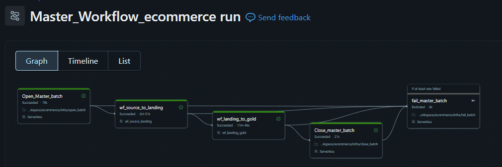

# E-Commerce Data Engineering Pipeline 🚀

An end to end, production-ready data engineering pipeline for e-commerce analytics built on **Azure Databricks** and **Delta Lake**. This project demonstrates modern data architecture patterns, scalable transformations, and enterprise-grade data workflows.

**Key Capabilities:**
- Real-time and batch data processing
- Incremental data ingestion with SCD Type 2 support
- Data quality validation and error handling
- Workflow orchestration and scheduling
- Cost-optimized transformations

---

## 📋 Table of Contents

- [Architecture](#architecture)
- [Tech Stack](#tech-stack)
- [Project Structure](#project-structure)
- [Data Flow](#data-flow)
- [Key Metrics Generated](#key-metrics-generated)
- [Data Assets](#data-assets)


---


## 🏗️ Architecture

This project follows the **Medallion Architecture**,:

```
Raw Data (Sources)
       ↓
    Landing 📂
    (Raw storage)
       ↓
    BRONZE 🥉
   (Raw Ingestion)
       ↓
    SILVER 🥈
  (Cleaned & Transformed)
       ↓
     GOLD 🥇
  (Business Metrics)
       ↓
   BI & Analytics
```

## 🛠️ Tech Stack

| Component | Technology 
|-----------|-----------
| **Cloud Platform** | Microsoft Azure
| **Data Warehouse** | Azure Databricks
| **Distributed Processing** | PySpark
| **Storage Format** | Delta Lake
| **Orchestration** | Databricks Jobs
| **Programming** | Python, SQL, PySpark

---

## 📁 Project Structure

```
ecommerce-data-engineering-project/
├── landing/                        
│   └── source_landing.py           # Store raw data as parquet files
|
├── bronze/                        
│   └── landing_bronze.py           # Ingest raw data from sources
│
├── silver/                         # Cleaned & transformed data layer
│   ├── silver_d_categories.py      
│   ├── silver_d_customers.py        #SCD Type 2 Implementation
│   ├── silver_d_products.py         #SCD Type 2 Implementation
│   ├── silver_f_order_items.py     
│   ├── silver_f_orders.py          
│   ├── silver_f_payments.py        
│   ├── silver_f_reviews.py         
│   └── silver_f_shippings.py       
│
├── gold/                            
│   ├── gold_daily_sales_aggt.py    # Daily sales aggregations
│   └── gold_fact_sales.py          # Comprehensive sales facts
│
├── infra/                          # Infrastructure & utilities
│   ├── initialize_script.py       
│   ├── functions.py               
│   ├── open_batch.py              
│   ├── close_batch.py              
│   └── fail_batch.py               
```

---

## 📊 Data Flow



---

## 📈 Key Metrics Generated


---

## 🔍 Data Assets

### Dimension Tables (Silver Layer)
- `d_customers` - Customer master data with historical tracking
- `d_products` - Product catalog with categories
- `d_categories` - Product category hierarchy

### Fact Tables (Silver Layer)
- `f_orders` - Order transactions with customer and product references
- `f_order_items` - Individual line items per order
- `f_payments` - Payment transaction details
- `f_reviews` - Customer product reviews and ratings
- `f_shippings` - Shipping and delivery information

### Aggregated Tables (Gold Layer)
- `daily_sales_agg` - Summarized daily sales metrics
- `fact_sales` - Comprehensive sales facts with all dimensions

---
